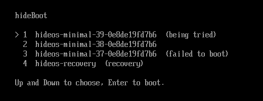
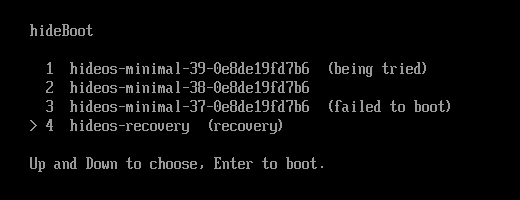

# hideBoot

A UEFI boot manager for Linux, written in Rust, with boot counting and
automatic fallback.

**Works, in QEMU.** It is the boot manager hideOS installs. hideOS's tests
boot through it under OVMF, Secure Boot included: an update that fails,
hangs or panics three times falls back to the previous system, an image the
firmware refuses is passed over, and the recovery system starts from the
menu. It follows `systemd-boot`'s on-disk convention, so either boots the
same ESP.

## What it looks like

Nothing, normally: it boots the newest entry with tries left, and the screen
goes from the firmware to the kernel. Hold a key as it starts, and it shows
the menu:



The entries are the file names in `\EFI\Linux\`, newest first, with their
state read from the boot counter: *being tried* has attempts left, *failed
to boot* has none and comes only when nothing else will start, and an entry
with no note has been marked good by the OS. Recovery images, from
`\EFI\Recovery\`, come last:



Up and Down, or the entry's number, then Enter. These pictures are QEMU's
screen, taken by hideOS's `cargo xtask hideboot-screenshot`, on a disk
prepared for them: the three entries are three names for one installed
image.

Build it with a Rust that has the UEFI target:

```sh
cargo build --release -p hideboot --target x86_64-unknown-uefi
```

`crates/hideboot-core` holds the decisions — parsing names, the boot order,
the counter after an attempt — and is tested on the host with `cargo test`.

## What it does

1. Lists the Unified Kernel Images in `\EFI\Linux\` on the ESP.
2. Orders them newest first by version in the file name.
3. Skips any whose boot counter is exhausted.
4. Decrements the counter of the one it picks — by renaming the file — and
   boots it.
5. Shows a menu when a key is held at startup, and never otherwise.
6. Sets `LoaderBootCountPath` and `LoaderEntrySelected`, systemd-boot's
   variables, so the OS knows which file to rename when it marks the boot
   good.
7. Lists recovery images in `\EFI\Recovery\` in the menu, after the
   entries, and boots one by itself only when no entry in `\EFI\Linux\`
   will start. A recovery image is never counted and never the default.

That is all. No filesystem drivers beyond FAT, no configuration language, no
theming, no kernel loading other than a signed UKI through the firmware's own
`LoadImage`.

## The contract

hideBoot knows nothing about hideOS. It reads and writes one convention, from
the [Boot Loader Specification](https://uapi-group.org/specifications/specs/boot_loader_specification/)
and [Automatic Boot Assessment](https://uapi-group.org/specifications/specs/boot_loader_specification/#boot-counting):

```
\EFI\Linux\<name>-<version>+<left>-<done>.efi
```

- `+<left>` — boots remaining before this entry is considered bad.
- `-<done>` — boots already attempted.
- No `+` suffix — the entry has been marked good by the OS and is not counted.
- `+0-<done>` — exhausted; skipped, and the next newest entry boots instead.

The OS marks an entry good by renaming it without the suffix once it has
reached a working state. That rename is the OS's job, not the boot manager's.
Any system that follows the convention can use hideBoot, and hideOS can switch
between it and `systemd-boot` without changing anything on disk.

## Rules

The same as every boot-path crate in hideOS and oxinit: no `unwrap`, `expect`,
`panic!` or slice indexing; errors as values; `unsafe` confined to one module
with a `// SAFETY:` comment per block. A boot manager that panics is a machine
that does not boot.

## License

Licensed under either of [Apache License, Version 2.0](LICENSE-APACHE) or
[MIT license](LICENSE-MIT) at your option.
